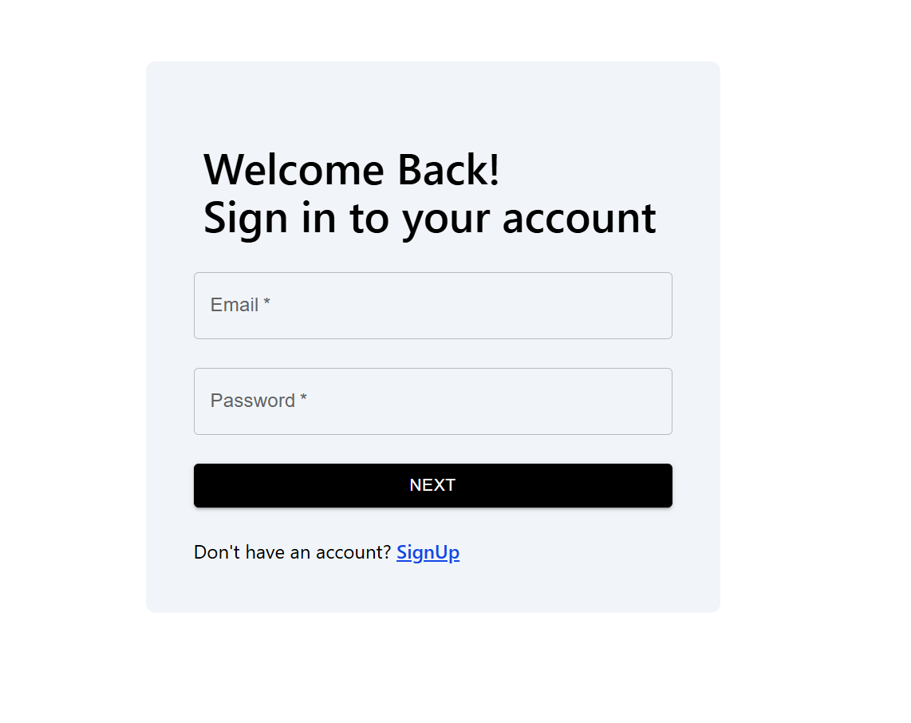
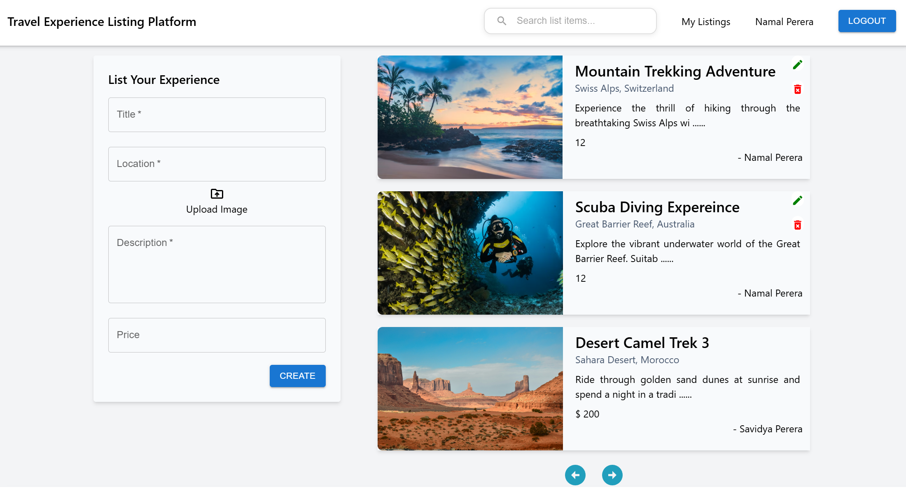
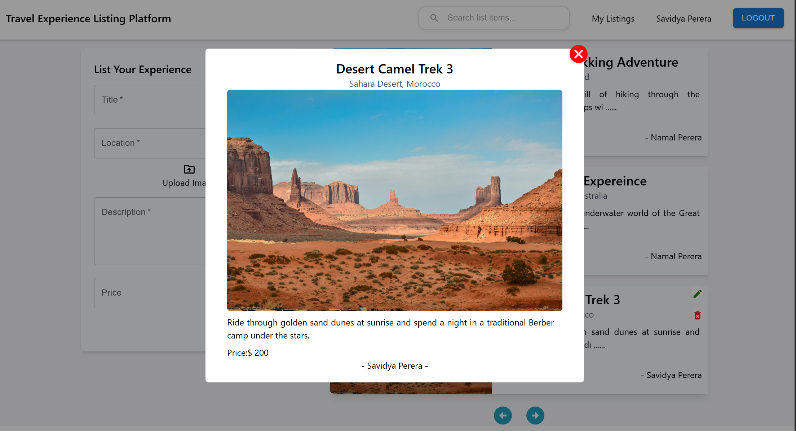

# Travel Experience Listing Platform

A full-stack web application designed to allow users to explore, create, and manage travel experiences. The platform provides a seamless interface for travelers to share their unique adventures with the world.

## Tech Stack

### Frontend

- **React 19** with **Vite** for fast, modern UI development.
- **React Router** for seamless client-side navigation.
- **Tailwind CSS v4** for responsive, modern styling and customized UI components.
- **Material UI** for pre-built, accessible UI components and icons.
- **Framer Motion** for smooth, dynamic animations.
- **Axios** for handling HTTP requests.

### Backend

- **Node.js** & **Express** providing a robust REST API framework.
- **MongoDB** with **Mongoose** as the NoSQL database for flexible data storage.
- **JWT (JSON Web Tokens)** & **bcrypt** for secure user authentication, password hashing, and authorization.
- **Firebase** for storing images.
- **Multer** for handling multipart/form-data, primarily used for file uploads.

## Key Features

- **User Authentication:** Secure registration, login, and session management using HTTP-only cookies and JWT.
- **Experience Listings:** Users can view a feed of travel experiences, including details like title, location, description, price, and images.
- **Create & Manage Listings:** Authenticated users can publish their own travel experiences and upload relevant images. They also have the ability to edit and delete their own listings.
- **Cloud Storage:** Integration with Firebase and Atlas to handle and store user-uploaded images efficiently and database.
- **CI/CD Pipeline:** GitHub Actions workflow (`deploy.yml`) set up for automated building and deployment to an AWS EC2 instance.

## Screenshots

  
  
    
  

## Project Structure

The project is structured into two main directories:

- `/frontend`: Contains the React application, organized into pages (like Home, Authentication), components, services (API calls).
- `/backend`: Contains the Express server, divided into routes, controllers, models (MongoDB schemas), utils, and middleware.

## Running Locally

1. **Clone the repository.**
2. **Backend Setup:**
   - Navigate to the `backend` directory: `cd backend`
   - Install dependencies: `npm install`
   - Start the development server: `npm run dev`
3. **Frontend Setup:**
   - Navigate to the `frontend` directory: `cd frontend`
   - Install dependencies: `npm install`
   - Start the Vite development server: `npm run dev`

## Demo Accounts

You can use the following accounts to easily test creating and editing listings:

- **Email:** `snirthana1@gmail.com` | **Password:** `123`
- **Email:** `snirthana5@gmail.com` | **Password:** `123`
- **Email:** `testuser@gmail.com` | **Password:** `test@123`

## Architecture & Key Decisions

- **Tech Stack:** The MERN stack (MongoDB, Express, React, Node.js) was chosen for its unified JavaScript ecosystem, enabling seamless context-switching between frontend and backend code.
- **Authentication:** Security is handled via JSON Web Tokens (JWT) stored in `HttpOnly` cookies. Upon successful login, the server issues a JWT and attaches it to an HTTP-only cookie, effectively mitigating Cross-Site Scripting (XSS) attacks since client-side JavaScript cannot access the token. A custom authentication middleware (`authMiddleware.js`) intercepts requests to protected routes to verify the token signature and extract the user payload.
- **Database Storage:** Travel listings are stored in MongoDB as documents within the `experiences` collection using Mongoose ODM to enforce schema validation.
- **Future Improvements:** Enhance overall responsiveness and introduce community features such as user profiles and a commenting system for individual listings. Additionally, expand listing customization options to allow users to create more engaging presentations beyond the basic details, and incorporate specific user interaction metrics including view, like, share, and save counts.

## Product thinking question

**Q: If this platform had 10,000 travel listings, what changes would you make to improve performance and user experience?**

To handle 10,000 listings effectively, my priority would be reducing the data payload sent to the client and optimizing database retrieval. I would implement **cursor-based pagination or infinite scrolling** on the frontend, combined with limit and skip queries in MongoDB, ensuring users only download the 10-20 listings they are currently viewing. To help users navigate the large dataset, I would add robust **search and filtering capabilities** (e.g., by location, price range, or categories). On the backend, adding **database indexes** to highly queried fields like location and price is crucial to prevent full-collection scans during these searches. I would also introduce a **caching strategy** using Redis to store the most frequently accessed or "trending" listings in memory, drastically reducing database load. Finally, for image-heavy listings, implementing a **Content Delivery Network (CDN)** with lazy loading for images would be essential to maintain fast initial page load times and a smooth user experience.
